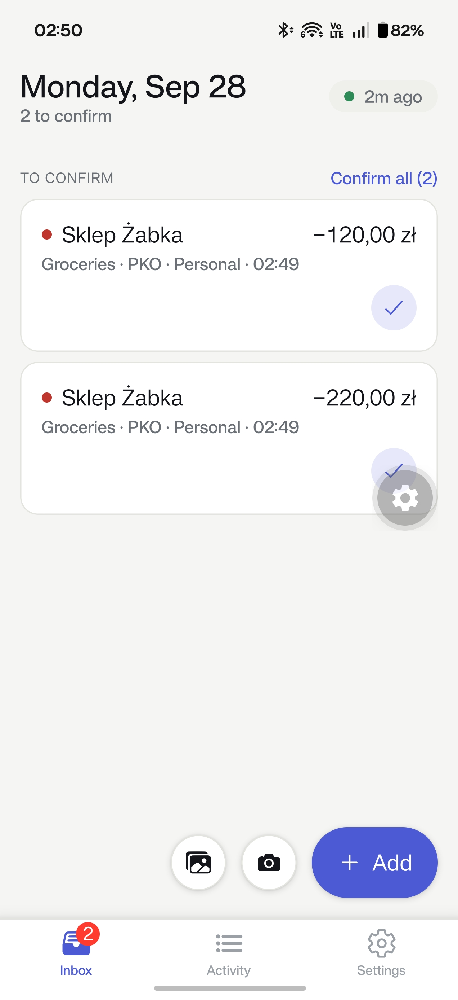
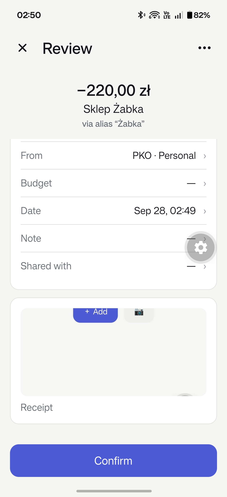
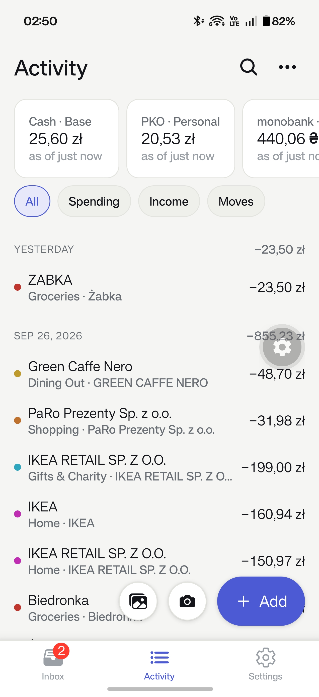
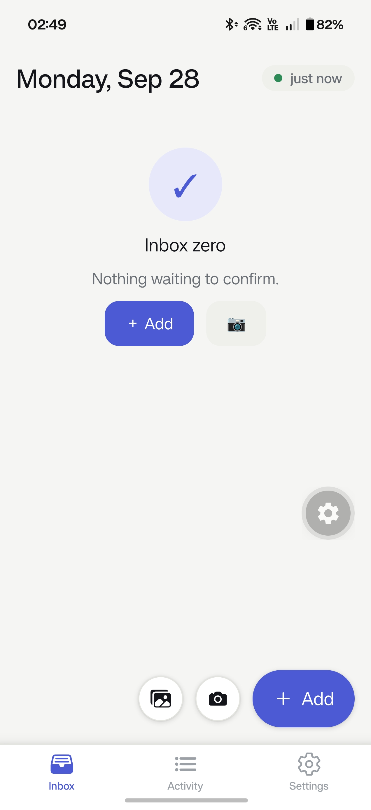

# Money done My Way - mmyway for short :)

**Log spending in seconds, straight into your own Firefly III.**

Type an amount, pick a payee, done. Or photograph a receipt and let a model fill in the
entry. Every entry waits in an Inbox until you confirm it, and only then goes to your
[Firefly III](https://www.firefly-iii.org/) server. It works offline and sends everything
once your server answers.

  
  
  

## Why I built it

I keep my finances in a self-hosted Firefly III. It's great for looking back at where the
money went, but typing an expense into it on a phone takes a while, and a receipt I don't
log right away gets forgotten. So I had a Telegram bot for it: send it an amount or a photo
of a receipt, and it made the transaction.

The bot did the job, but it had problems. It needed a network to do anything, its
categories were hardcoded in five places, and there was no good way to check an entry
before it landed in my books. mmyway replaces it with an app that:

- makes logging an expense a few taps: amount first, then a payee it already knows
- reads receipts for me, with a model I choose
- never writes to Firefly III until I've looked at the entry and confirmed it
- keeps working with no signal and catches up later

## What it does

- **Amount-first capture.** A big keypad, then the payee. Payee chips come from your own
  Firefly III history, most recent first, and bring their usual category and account with
  them. Expense, Income or Transfer, in any currency, dated today, yesterday or any day.
- **Receipts.** Take a photo, pick one from the gallery, or share an image from another
  app. Your own OpenAI-compatible model (LM Studio, for example) reads it first, then
  Google Gemini if you've set it up. Anything the reader wasn't sure of is marked
  "check this". The photo is attached to the transaction in Firefly III.
- **An Inbox that approves.** Entries wait under **To confirm**. Swipe right to confirm,
  left to delete, or confirm them all at once. Anything Firefly III rejects shows the
  reason, with Retry or Discard. Recurring transactions Firefly III created on its own come
  in to review too.
- **Aliases.** Correct a receipt's printed shop name once ("ZABKA POLSKA SP Z O O" →
  Żabka), and every later receipt from that shop goes to the right payee.
- **Activity.** Balances for each account, and your transactions grouped by day with daily
  totals. Search, filter, edit, delete, or attach a receipt to an older transaction.
  Scrolling past what's on the phone loads older history from Firefly III.
- **Cash count.** Count your cash envelopes in one go, by amount or with a banknote-and-coin
  pad, and one confirm books the difference for each envelope that's off.
- **Offline first.** Everything works without a connection. Changes go out in order, each
  exactly once, as soon as Firefly III answers. You can give it several addresses for your
  server (home network, VPN, public name) and it uses the first one that answers.

  

## Private by design

Your entries live on your phone and on your own Firefly III server, and nowhere else.
There's no account, no server of mine, no analytics, no ads and no tracking. The Firefly III
access token is kept in the phone's secure storage. Receipt photos go to Google only if you
add your own Gemini key; with a local model, they never leave your network. See the
[privacy policy](PRIVACY.md).

## Get the app

mmyway runs on **Android** and needs Firefly III with API version 6.3.2 or later. Download
it from [GitHub Releases](https://github.com/mkloouo/mmyway/releases/latest):

- Download the `arm64-v8a` APK for most phones, or the `armeabi-v7a` APK for older 32-bit
  phones. If you're not sure, the `universal` APK works on every phone but is a bigger
  download. Your phone will ask you to allow installing from outside the store.
- **Checking your download:** each release includes a `SHA256SUMS` file.
- **First run:** in Settings, enter your Firefly III address and a personal access token
  (Firefly III → Options → Profile → OAuth → Personal access tokens).

See the [changelog](CHANGELOG.md) for what's new in each version.

## Feedback

Found a bug or have an idea? [Open an issue](https://github.com/mkloouo/mmyway/issues)
or email [feedback@mkloouo.com](mailto:feedback@mkloouo.com).

## License

[PolyForm Noncommercial License 1.0.0](LICENSE): you're free to use, change and share it
for noncommercial purposes.

Building it yourself? Start with [AGENTS.md](AGENTS.md) for the commands and
[docs/ARCHITECTURE.md](docs/ARCHITECTURE.md) for how capture, confirm and sync fit together.
